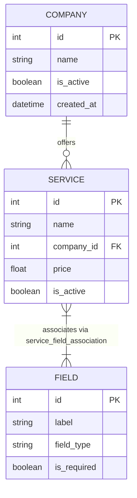

# Document For All — E-Payment & Commercial Center Management System


An enterprise-grade, modular **desktop & wep** application built to streamline operations for E-Payment Centers, Libraries, and Commercial Outlets.  
Designed with a **Dynamic Forms Engine** to prevent hardcoded business logic and support runtime schema extensions.


---

## Architectural Key Highlights

* **Dynamic Forms Engine**: Engineered using a **Many-to-Many relational database structure** (`service_field_association`), allowing new payment providers and customized form fields to be registered dynamically at runtime without modifying application source code.
* **ORM & Data Layer Isolation**: Utilizes **SQLAlchemy** declarative models with strict context-managed database sessions (`get_db`) to guarantee thread safety and eliminate database connection/memory leaks.
* **Modular Architecture**: Clean separation between UI layers (PySide6), Data Access Layers (Models/Schemas), and PDF Generation Engines (ReportLab).
* **Robust Migration & Schema Safety**: Configured with cascading strategies (`ondelete='CASCADE'`) and indexed keys for high-performance lookup and referential integrity.

## Tech Stack & Dependencies
* **Language:** `Python 3.x`
* **GUI Framework:** `PySide6 (Qt for Python)`
* **Database & ORM:** PostgreSQL / SQLite3 via SQLAlchemy ORM
* **Reporting:** ReportLab (Invoice & Barcode Generation)
* **Quality & Linting:** Ruff CLI
* **Version Control:** Git & GitHub

## Getting Started

* **Prerequisites:** Python 3.10+ installed

### **Installation & Setup:**

* **Clone the repository:**

```Bash
git clone [https://github.com/lian-kanani/document_for_all.git](https://github.com/lian-kanani/document_for_all.git)
cd document_for_all 
```
* **Set up Virtual Environment:**

```Bash
python -m venv venv
# On Windows:
venv\Scripts\activate
# On Linux/macOS:
source venv/bin/activate
```
* **Install Dependencies:**

```Bash
pip install -r requirements.txt
```
* **Run Application:**

```Bash
python main.py
```


## Entity-Relationship Diagram (ERD) (`not ready yet`)



#### Author: *Lian Kanani*